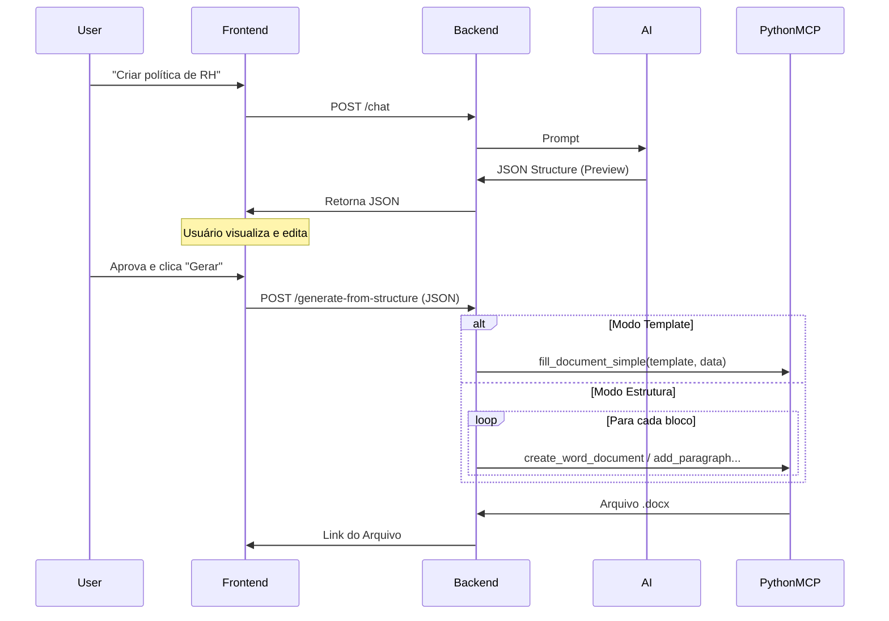

# Proposta de Arquitetura: Fluxo de Pré-visualização de Documentos

## 1. Contexto e Objetivo

Atualmente, o fluxo de geração de documentos é direto: o usuário solicita via chat e a IA invoca ferramentas para criar o arquivo `.docx` final imediatamente. Isso impede que o usuário valide ou ajuste o conteúdo antes da materialização do arquivo.

O objetivo desta proposta é introduzir uma camada de **Pré-visualização Interativa**. O usuário receberá um esboço estruturado do documento, poderá editá-lo na interface e, somente após aprovação, o documento final será gerado.

## 2. Fluxo de Trabalho Proposto

### Fluxo Atual

1. **Usuário**: "Crie uma política de viagens."
2. **IA**: Chama `create_word_document` ou `fill_document_simple` imediatamente.
3. **Sistema**: Gera `.docx` e faz upload.
4. **Usuário**: Recebe o link do arquivo final.

### Novo Fluxo (Preview-First)

1. **Usuário**: "Crie uma política de viagens."
2. **IA**: Gera uma estrutura de dados (JSON) representando o documento sugerido (seja estrutura livre ou dados para template).
3. **Frontend**: Renderiza uma visualização editável (Formulário de Template ou Blocos de Texto).
4. **Usuário**: Revisa, edita texto, remove seções indesejadas.
5. **Usuário**: Clica em "Gerar Documento Final".
6. **Backend**: Recebe a estrutura aprovada e orquestra a criação do arquivo `.docx`.

## 3. Arquitetura Técnica

### 3.1 Estrutura de Dados (JSON Schema)

O sistema deve suportar dois tipos de estrutura: **Baseada em Blocos** (criação livre) e **Baseada em Template** (preenchimento).

#### Tipo A: Baseado em Blocos (Criação Livre)

```json
{
  "mode": "structure",
  "metadata": { "title": "Política de Viagens" },
  "content": [
    { "type": "heading", "level": 1, "text": "1. Objetivo" },
    { "type": "paragraph", "text": "Texto..." }
  ]
}
```

#### Tipo B: Baseado em Template (O caso do `fill_document_simple`)

Quando a IA decidir usar um template existente:

```json
{
  "mode": "template",
  "templateId": "policy_template_v2.docx",
  "data": {
    "titulo_documento": "Política de Home Office",
    "departamento": "Recursos Humanos",
    "tabela_regras": [
      { "regra": "Horário", "descricao": "09h às 18h" },
      { "regra": "Equipamento", "descricao": "Notebook fornecido" }
    ]
  }
}
```

### 3.2 Mudanças no Backend (Node.js)

1.  **Novo Tool ou Instrução de Sistema**:

    - Instruir o modelo a retornar o JSON acima.
    - Se for usar `fill_document_simple`, retornar `mode: "template"` com os dados que _seriam_ enviados para a ferramenta.

2.  **Endpoint de Geração (`POST /documents/generate-from-structure`)**:
    - **Caso `mode: structure`**: Itera e chama `add_paragraph`, etc.
    - **Caso `mode: template`**: Chama `fill_document_simple(templateId, data)`.

### 3.3 Mudanças no Frontend

- **Componente de Preview**:
  - Se `mode: template`: Renderiza um formulário com os campos de `data`.
  - Se `mode: structure`: Renderiza blocos editáveis.
- **Botão de Ação**: "Gerar Documento" que envia o estado atual do JSON para o backend.

## 4. Diagrama de Sequência



## 5. Próximos Passos

1.  **Validar Schema**: Confirmar se o JSON cobre todos os casos de uso.
2.  **Implementar Endpoint de Geração**: Criar a lógica no `server.ts`.
3.  **Ajustar Prompt**: Modificar o `SYSTEM_INSTRUCTION` para priorizar o preview.
